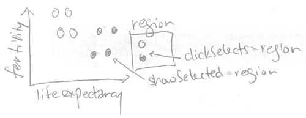
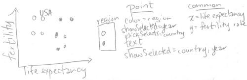
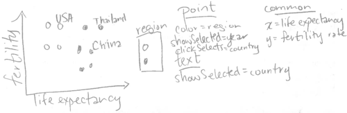
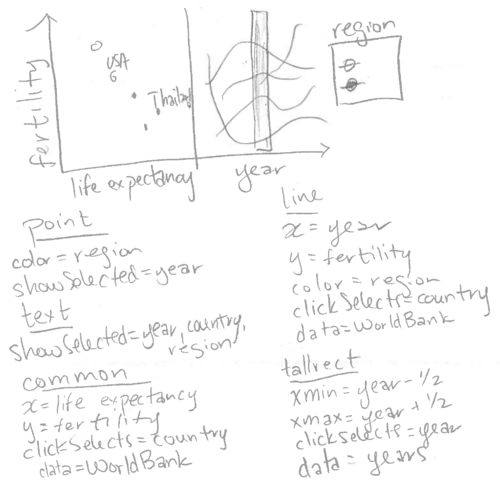

# Chapter 4, clickSelects

```{r setup, echo=FALSE}
knitr::opts_chunk$set(fig.path="Ch04-figures/")
```

This chapter explains clickSelects, one of the two main keywords that
animint introduces for interactive data visualization. The
clickSelects keyword specifies a geom for which clicking updates a
selection variable. Each geom in a data visualization has its own data
set, and its own definition of the clickSelects keyword. So clicking
on different geoms can change different selection variables.

After reading this chapter, you will be able to

* Understand how interactive legends implicitly use clickSelects.
* Use the clickSelects keyword in your plot sketches.
* Translate your plot sketches with clickSelects into R code.
* Use the `selector.types` option to specify multiple selection
  variables.
  
## Interactive legends implicitly use clickSelects {#implicit-clickSelects}

In this section, we will explain how the clickSelects keyword is
implicitly used in interactive legends. If you have read the previous
chapters, you have already implicitly used clickSelects, which was
automatically created for the interactive legends in the previous
chapters. For example, consider the sketch of the World Bank data viz
from the last chapter.



Since the legend has `clickSelects=region`, clicking an entry of that
legend updates the `region` selection variable. Note that animint
automatically makes every discrete legend interactive, so you do not
need to explicitly specify `clickSelects=region` for the legend. In
fact, when we specified `color=region` for the `geom_point`, animint2
does two things automatically:

* `showSelected=region` is assigned to the same
  `geom_point`.
* `clickSelects=region` is assigned to the color legend.

Note that `clickSelects` keywords are not limited to interactive
legends. Each geom has its own `clickSelects` variable, which
determines which selection variable is updated after clicking that
geom. In the next section we will give several examples of how
`clickSelects` can be used in combination with `showSelected` to create
interactive data visualizations.

## Use clickSelects to identify points on a scatterplot {#clickSelects-keyword}

The goal of this section is to create the following visualization of
the World Bank data.



To start, consider the following R code which generates a
scatterplot of the World Bank data:

```{r Ch04-ggplot-scatter}
library(animint2)
data(WorldBank)
scatter <- ggplot()+
  geom_point(aes(
    x=life.expectancy, y=fertility.rate, color=region,
    key=country),
    showSelected="year",
    clickSelects="country",
    data=WorldBank)
scatter
```

Note that the plot above is not interactive, because it is rendered
using the traditional R graphics device. In contrast,
rendering the same ggplot using animint2 results in the following
interactive plot:

```{r Ch04-viz-scatter}
(viz.scatter <- animint(
  scatter=scatter,
  duration=list(year=2000)))
```

Try clicking data points in the scatterplot above. You should see the
value of the `country` selection menu change after clicking a data
point. You should also see that the data point for the selected
country is darker than the others. This serves to highlight the
current selection, and is performed automatically for each geom with
`clickSelects`. By default the selected point has alpha=1 (fully
opaque, no transparency), and the other points have alpha=0.5
(semi-transparent). These defaults can be customized; for example in
the code below a black outline is used to highlight the current selection.

```{r}
animint(
  ggplot()+
    geom_point(aes(
      x=life.expectancy, y=fertility.rate, fill=region,
      key=country),
      shape=21,
      color="black",
      color_off=NA,
      showSelected="year",
      clickSelects="country",
      data=WorldBank))
```

The data visualization above shows the currently selected country name in
the selection menu, but it would be better to show it as a text label
on the scatterplot. We can do that by adding a `geom_text` layer with
two showSelected variables:

```{r Ch04-viz-text}
viz.text <- viz.scatter
viz.text$scatter <- scatter+
  geom_text(aes(
    x=life.expectancy, y=fertility.rate, label=country,
    key=country),
    showSelected=c("year", "country"),
    data=WorldBank)
viz.text
```

After clicking a data point in the scatterplot above, you should see a
text label with the country name appear. Furthermore, **try** changing
the year using the selection menu. You should see the text label move
in a smooth transition along with the corresponding data
point. 

The data visualization above contains more than one geom, each with
different interactive features. **Try** clicking the "Start Tour"
button at the bottom of the data visualization, which will show what
interactive features are available for the first geom in the data
visualization. Clicking Next will show information for the next geom,
and clicking Done or the grey background will end the Tour. The "Start
Tour" feature can be useful for new users of your data visualization
to discover what interactive features are present in each geom. The
information displayed during the tour can be customized, by specifying
the `help` and `title` params of each geom.

As explained in the last chapter, any variable specified using the
`showSelected` argument of a geom is treated as an interactive variable. In the
example above, we specified two `showSelected` variables for the
`geom_text`. This means to only draw a text label for the rows of the
`WorldBank` data set that match the current values of both selection
variables. Since each combination of `country` and `year` has one row
in these data, only one text label will be shown at a time.

**Try** clicking the legend entry that corresponds to the region for
the currently selected country (e.g. if Canada is selected, try
clicking the North America legend entry). You should see the point
disappear, but the text stay displayed. 

**Exercise:** how can you get the text to disappear along with the
point? Hint: you need to add a keyword to the `geom_text`.

In the last chapter, we introduced the terms "direct manipulation" and
"indirect manipulation" to describe interactions with legends and
menus. In the data viz above, we can change the value of the `country`
selection variable by either clicking a data point (direct
manipulation) or using the selection menu (indirect
manipulation). Both techniques are useful, but for different
purposes:

* Direct manipulation by clicking data points is useful to find the
  names of countries with extreme values of fertility rate and life
  expectancy. For example, for the year 1960, clicking the point at
  the bottom left of the plot reveals the country name Gabon.
* Indirect manipulation using menus is useful to see the plotted
  position of a country of interest. For example, it would be
  difficult to find France by clicking all the different points, but
  it is simple to find France by typing its name in the selection
  menu.
  
Note that when the data viz above is first rendered, the selected
country is Andorra and the selected year is 1960. Since the data for
Andorra is missing in 1960, there is no text label drawn at first. To
change the first selection, you can specify the `first` option, as
explained in the next section.
  
## The first option {#first-option}

To specify the selection that should be shown when the data viz is
first rendered, use the `first` option. It should be a named list with
entries for each selection variable. For example, the code below
specifies 1970 as the first year, United States as the first country,
and North America and South Asia as the first regions.

```{r Ch04-viz-first}
viz.first <- viz.text
viz.first$first <- list(
  year=1970,
  country="United States",
  region=c("North America", "South Asia"))
viz.first
```

Note that in the data viz above, there is only one country selected at
a time. In the next section, we will explain how the `selector.types`
option can be used to change `country` to a multiple selection
variable.

## The selector.types option {#selector-types-option}

In this section our goal is to produce a slightly more complicated
version of the scatterplot in the last section. The sketch below has
only one difference with respect to the sketch from the last section:
text labels are shown for more than one country.



In animint, each selection variable has a type, either single or
multiple. Single selection means that only one value can be selected
at a time. Multiple selection means that any number of values can be
selected at a time. In the plots in the last section, multiple
selection was used for the `region` variable but not for the `year`
and `country` variables. Why is that?

By default, animint assigns multiple selection to all variables that
appear in interactive discrete legends, and single selection to other
variables. However, single or multiple selection can be specified by
using the `selector.types` option. In the R code below, we use the
`selector.types` option to specify that `country` should be treated as
a multiple selection variable.

```{r Ch04-viz-multiple}
viz.multiple <- viz.first
viz.multiple$selector.types <- list(country="multiple")
viz.multiple
```

When the data viz above is first rendered, it shows data points from
the year 1970, for each country in North America and South Asia. It
also shows a text label for the United States.

You may have noticed that it is easy to add countries to the current
selection, by clicking data points. Normally, clicking a selected data
point will remove that country from the current selection. However, in
this particular data viz, it is not so easy to remove them, since the
text labels are rendered on top of the data points.

**Exercise:** Re-make the data viz above so that clicking a text label
  removes that country from the selection set. Hint: you need to add
  a `clickSelects` keyword to the `geom_text`.

Note that in the data viz above, the year variable can only be changed
via the selection menu.


In the next section, we will add a facet with a geom that can be
directly clicked to change the year variable.

## Selecting a year on a time series plot {#time-series-plot}

The goal of this section is to add a time series plot that can be
clicked to change the selected year.


Note that the sketch above includes `geom_tallrect`, a new geom
introduced in animint. It is "tall" because it occupies the entire
vertical space of the plot, and thus only requires definition of its
horizontal limits via the `xmin` and `xmax` aesthetics. Specifying
`clickSelects=year` means that we want to be able to draw one tallrect
for each year, and click a tallrect to change the selected year. Thus
we need to create a new data set called `years` with one row for each
unique year of the `WorldBank` data.

```{r}
years <- data.frame(year=unique(WorldBank$year))
head(years)
```

Next, we add the time series ggplot to the existing data viz.

```{r Ch04-viz-timeSeries}
viz.timeSeries <- viz.multiple
viz.timeSeries$timeSeries <- ggplot()+
  geom_tallrect(aes(
    xmin=year-0.5, xmax=year+0.5),
    clickSelects="year",
    alpha=0.5,
    data=years)+
  geom_line(aes(
    x=year, y=fertility.rate, group=country, color=region),
    clickSelects="country",
    size=3,
    alpha=0.6,
    data=WorldBank)
viz.timeSeries
```

**Try** clicking the background of the time series in the data viz
  above. You should see the data points and text labels move in a
  smooth transition to their places at the newly selected year.
  
**Animation exercise:** make the data viz animated by specifying the
  `time` option,
  [as explained in Chapter 3](Ch03-showSelected.html#animation-time).

**Multi-layer exercise:** add a `geom_text` that shows the current
  year on the scatterplot. Add a `geom_path` that shows data for the
  previous 5 years.
  
## Selecting a year on a time series facet {#time-series-facet}

The goal of this section is to add a facet with a time series plot
that can be clicked to change the selected year.



First, we re-create the scatterplot from the previous section using the
[addColumn then facet idiom](Ch99-appendix.html#addColumn-then-facet), 
which is useful for creating ggplots
with aligned axes.

```{r Ch04-ggplot-scatterFacet}
add.x.var <- function(df, x.var){
  data.frame(df, x.var=factor(x.var, c("life expectancy", "year")))
}
scatterFacet <- ggplot()+
  geom_point(aes(
    x=life.expectancy, y=fertility.rate, color=region,
    key=country),
    showSelected="year",
    clickSelects="country",
    data=add.x.var(WorldBank, "life expectancy"))+
  geom_text(aes(
    x=life.expectancy, y=fertility.rate, label=country,
    key=country),
    clickSelects="country",
    showSelected=c("year", "country", "region"),
    data=add.x.var(WorldBank, "life expectancy"))+
  facet_grid(. ~ x.var, scales="free")+
  xlab("")+
  theme_bw()+
  theme(panel.margin=grid::unit(0, "lines"))
scatterFacet
```

Note that the ggplot above uses the same `aes` definitions as the
scatterplot from the previous section. The only difference is that we
have used an augmented `WorldBank` data set with an additional
`x.var` variable that we use with `facet_grid`. Below, we add
geoms for a time series plot that is aligned on the fertility rate
axis.

```{r Ch04-ggplot-scatterTS}
scatterTS <- scatterFacet+
  geom_tallrect(aes(
    xmin=year-0.5, xmax=year+0.5),
    clickSelects="year",
    alpha=0.5,
    data=add.x.var(years, "year"))+
  geom_line(aes(
    x=year, y=fertility.rate, group=country, color=region),
    clickSelects="country",
    size=3,
    alpha=0.6,
    data=add.x.var(WorldBank, "year"))
scatterTS
```

The two geoms defined above occupy a new facet for the `"year"`
value of the `x.var` variable (defined by the `add.x.var`
function). Since these two geoms have different definitions of
`clickSelects`, clicking each geom will update the plot in a different
way. Note that for the `geom_line` we specify `size=3`, which means a
line stroke width of 3 pixels. In general it is a good idea to
increase the size of geoms with `clickSelects`, to make them easier to
click.

Also note that we specified `alpha=0.5` for the `geom_tallrect` and
`alpha=0.6` for the `geom_line`. Since both of these geoms define
`clickSelects`, some plotted lines and tallrect will be selected, and
others will not be selected. The alpha values in R code specify the
opacity of the selected objects, and other objects will have an
`alpha` opacity which is 0.5 less than that value. In the example
above, the un-selected lines will have `alpha=0.1`, and the
un-selected tallrects will have `alpha=0` (completely transparent).

As of September 2023, it is also possible to specify the opacity,
fill, and color for objects which are not currently selected
(`alpha_off`, `fill_off`, `color_off`). Users can specify these
parameters in the geom (not aes) to freely create a different
appearance for selected and un-selected items, instead of being forced
to rely on the behavior described above. For more information, see the
discussion and example in [Chapter 6, section Specifying how selection
state is displayed](Ch06-other.html#display-selection-state).

Finally, we use the R code below to render the new aligned scatterplot
and time series using animint.

```{r Ch04-viz-facets}
(viz.facets <- animint(scatterTS))
```

The interactive data viz above contains a new panel with lines that
show a fertility rate time series over all years. Since we specified
`clickSelects=country` for the `geom_line`, clicking a line updates
the set of selected countries. Since we specified `clickSelects=year`
for the `geom_tallrect`, clicking on a tallrect updates the selected
year. 

**Exercise:** add `time`, `duration`, `first`, and `selector.types`
  options to the data viz above.

## Chapter summary and exercises {#exercises}

This chapter explained `clickSelects`, one of the two main keywords
that animint introduces for interactive data visualization design. We
used the World Bank data set to show how `clickSelects` can be used to
specify different interactions for each of the plotted geoms. We
explained how the `first` option can be used to specify the selected
values that are used when the animint is first rendered. We also
explained how the `selector.types` option can be used to specify
multiple selection variables.

Exercises:

* So far we have seen three different ways to change selection
  variables: (1) interactive legends, (2) selection menus, and (3)
  clicking data with `clickSelects`. Order these three techniques in
  terms from most to least direct manipulation. Which technique is
  preferable in what circumstances?
* When `geom_point(clickSelects=something, alpha=0.75)` is rendered
  with the usual R graphics device, how much opacity/transparency is
  present for all data points? When animint2 renders the same geom,
  some points will be selected and others not. What is the
  opacity/transparency of selected points? What is the
  opacity/transparency of points which are not selected?
* Add `aes(size=population)` to the points in the World Bank
  scatterplot. Is the size legend interactive? Why?
* Add a `geom_text` to the World Bank scatterplot that shows the
  selected year.
* Add a `geom_text` to the World Bank time series to show the names of
  the selected countries.
* Add a `geom_path` to the World Bank scatterplot to show data for the
  last 5 years.
* Use the `time` option to make an animated version of `viz.facets`.
* Use `help` and `title` params for each geom in `viz.facets`, to make
  a Tour which is more informative about what is displayed in each
  geom.

Next, [Chapter 5](Ch05-sharing.html) explains several different
methods for publishing and sharing animints on the web.
